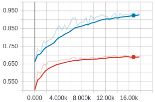

# Answer-Verifier-pytorch
A pytorch implementation of [Read + Verify: Machine Reading Comprehension
with Unanswerable Questions](https://arxiv.org/pdf/1808.05759.pdf)

It is the first architecture proposed to handle un-answerable question in Squad 2.0.

The current implementation achieves 69% accuracy on SQuad2.0.
